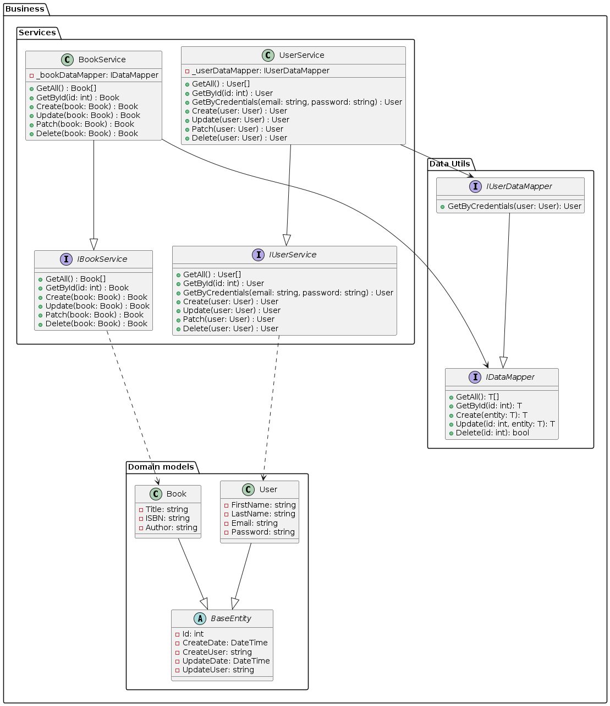
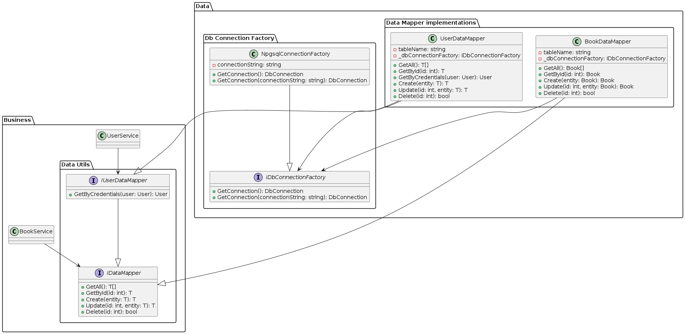
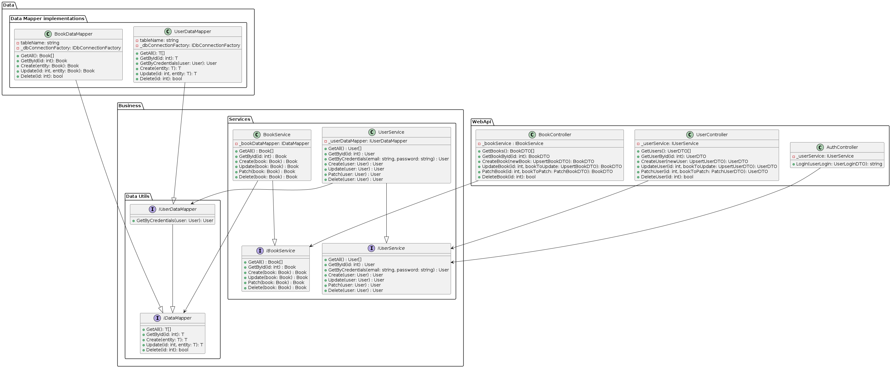

# Book REST API

This is a sample web api made in .NET Core 8. The goal of this project is to showcase how to assemble and implement a REST Api to perform CRUD operations over an entity. The web api also includes JWT token authentication.

The project is based on a made up user story which serves as a leading domain for the program.

## User story

    As a library administrator, I want to have a RESTful API to manage a catalog of books efficiently. The API should support CRUD operations and adhere to the principles of REST architecture. Additionally, it should be developed using .NET Core 8, include Swagger for documentation, and avoid the use of EF Core, Dapper, and other Object-Relational Mapping (ORM) tools.

    Create Book:

        As a user, I should be able to add a new book to the catalog.
        The API should expose an HTTP POST endpoint to create a new book.
        The request payload should include necessary details such as title, author, ISBN, and any other relevant information.
        The response should include the newly created book with its unique identifier.
    
    Read Book:

        As a user, I should be able to retrieve information about a specific book.
        The API should expose an HTTP GET endpoint to retrieve a book based on its unique identifier.
        The response should include details such as title, author, ISBN, and other relevant information.
    
    Update Book:

        As a user, I should be able to update the details of an existing book in the catalog.
        The API should expose an HTTP PUT endpoint to update the information of a specific book.
        The request payload should include the unique identifier of the book and the updated information.
        The response should include the updated book details.
    
    Delete Book:

        As a user, I should be able to remove a book from the catalog.
        The API should expose an HTTP DELETE endpoint to delete a specific book based on its unique identifier.
        The response should confirm the successful deletion of the book.
    
    List All Books:

        As a user, I should be able to retrieve a list of all books in the catalog.
        The API should expose an HTTP GET endpoint to retrieve the entire catalog.
        The response should include a collection of books with their details.

### Requirements

There are some additional restrictions related to technical aspects:

1. I cannot use Entity Framework, Dapper or Mediator to perform operations against a Db.
2. The code should adhere to Clean Architecture principles.
3. The development should be lead by Test-Driven Development methodologies (TDD).
4. The application should be divided in some basic modules:
   1. API: to expose endpoints to perform CRUD operations for an entity.
   2. Data Layer: to enclose the logic related to data access.
   3. Buisiness logic layer: to enclose the business rules related to the domain.
   4. Unit tests: to enclose unit tests for every layer of the application.

### Design

#### Business layer

In this layer we define the domain entities that our program is going to work with. Also we define additional abstractions (interfaces) to represent the basic operation that a program may perform with our domain entities.

1. **Domain models**: here we have the Book entity, User entity and the BaseEntity which is just an abstract class containing the basic properties that we expect to find in both entities
2. **Services**: here we define some interface that work like a contract, specifying some CRUD operations that our program may execute with our domain models.
3. **Data Utils**: here we define a IDataMapper and a IUserDataMapper interface which represents the basic operations that we can do against a persistent support like a Db or a File system.
  

* **Observation**: We are not defining data access logic at this level. We are going to define such logic in the *Data access layer*

#### Data access layer

In this layer we provide the implementation details of some previously defined interfaces from the business layer.

Because I'm working with a Postgres Database, I have defined some concrete classes to connect to that specific database and also some DataMapper concrete classes that contains the required logic to perform CRUD operations against the DB.

The concrete implementations of the business interfaces are:

1. **UserDataMapper**: follows the contract of `IUserDataMapper` and contains the required logic to perform DB operations for the User entity.
2. **BookDataMapper**: follows the contract of `IDataMapper<Book>` and contains the required logic to perform DB operations for the Book entity.
   

In addition I have defined a `IDbConnectionFactory` interface that builds and return a `DbConnection`. The main goal is to separate the contruction of the specific Postgres connection. This way the `DataMapper` classes are not concerned about what kind of DB they are connecting to. Also this interface could be extended by other concrete Db connection factories in case we need to interact with other Db engines.

#### WebApi layer

This layer is responsible of exposing the CRUD endpoints required to manage Books and Users.

In this package we have references to the **Data Layer** and to the **Business Layer** and we setup the concrete classes corresponding to the interfaces by using the Dependency injection functionlity that comes with .Net Core. 

Here we define some controllers that are responsible of exposing the endpoints with the appropriate HTTP Verbs required to perform the CRUD operations:

1. `AuthController`: it exposes the login method required to generate the JWT token. This JWT token is required to interact with the rest of the endpoints
2. `BookController`: it exposes the methods for CRUD operations for a Book entity.
3. `UserController`: it exposes the methods for CRUD operations for a User entity.

All the controllers have references to the Business interfaces defined by the business layer. And they perform the operations by interacting with such interfaces, so they don't access to the Data Layer directly.

#### Tests

There is a test project `Business.Test` made in MSTest and using Moq. This project aims to test Business layer classes only. Additional unit tests projects will be needed for the rest of the application.

You can run the tests by calling `dotnet test` at the root of the solution.

### Project structure

* bl-tech-interview-e3 : **solution**
  * Business : **library class project**
    * Domain: domain classes
    * Service: services contracts and implementation
    * Utils: util classes for the services
  * Business.Test: **test project for the business layer**
  * Data: **library class project**.
    * Mapper (concrete implementation of the data mapper interfaces defined in the business layer)
    * Utils (db connection factory and db command extension methods)
  * WebApi: **web api project**
    * Controllers (controllers with methods for the CRUD operations)
    * DTO (DTO classes created to represent responses and request of the controllers)
    * Utils (Domain to DTO mappers)

### How to run
The application can run locally by these two methodologies:

1. **Running locally**
   1. This requires you to have a local instance of Postgres SQL.
   2. Once you have a local instance of postres you can use the `init.sql` script to initialize the DB for the project.
   3. Once the DB has been initiated you can run the application by using the launch options known as `.NET Core Launch(web)` in the launch settings of `.vscode/launch.json`.
      1. Additional tinkering with the configuration settings may be necessary if you chose this methodology.
2. **Running Docker container**
   1. Build docker image: `docker compose build`
   2. Run docker image: `docker compose up`
   3. Interact with the API by using postman, there is a sample collection in the file `WebApi.postman_collection.json`
